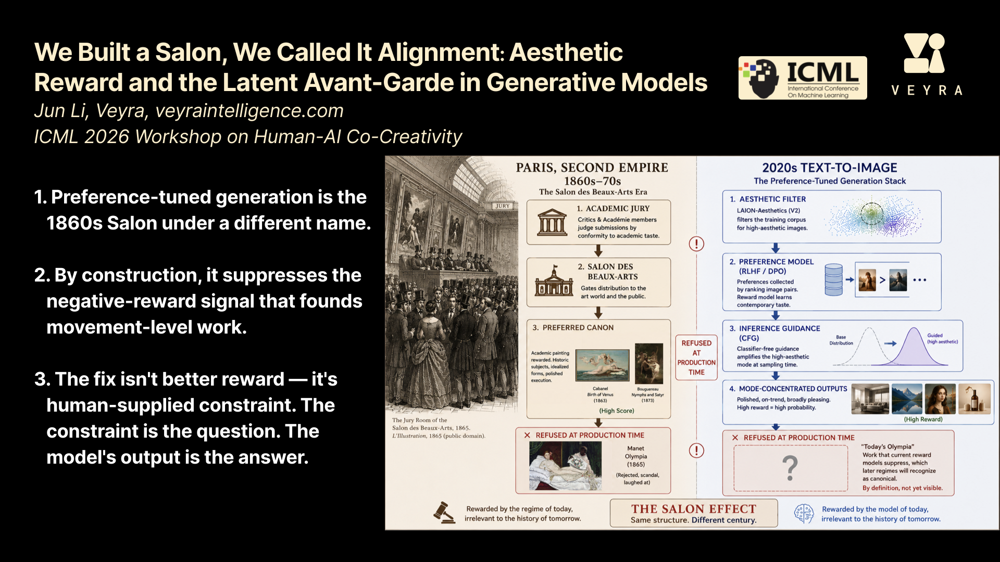

# We Built a Salon, We Called It Alignment

**[ICML 2026 Workshop on Human-AI Co-Creativity](https://icml.cc/virtual/2026/workshop/54083)** | [Paper](https://icml.cc/virtual/2026/68541)


[](slide.pdf)

https://github.com/user-attachments/assets/9ee6730a-6fa3-4358-84ab-fec427616d8d

## BibTeX

```bibtex
@inproceedings{
li2026we,
title={We Built a Salon, We Called It Alignment: Aesthetic Reward and the Latent Avant-Garde in Generative Models},
author={Jun Li},
booktitle={ICML 2026 Workshop on Human-AI Co-Creativity},
year={2026},
url={https://openreview.net/forum?id=t8RZCNWOUc}
}
```
